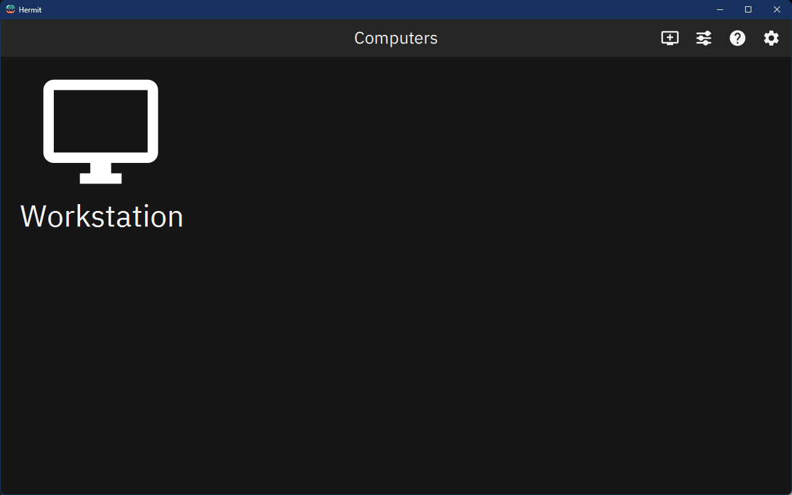
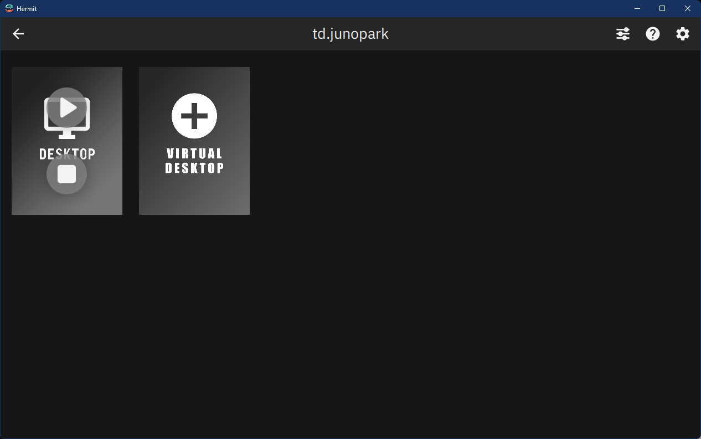
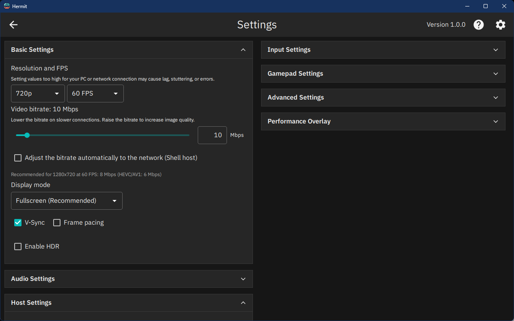

# Hermit

Hermit은 Windows용 게임 스트리밍 클라이언트입니다. GameStream 프로토콜로 다른 PC의 게임, 앱, 데스크톱 전체를
스트리밍하고, 매일 원격으로 쓰기 좋은 기능을 더했습니다. 스트림 위 설정 패널, 실시간·자동 비트레이트,
이미지와 파일까지 오가는 클립보드 동기화, 호스트 원격 종료, 그리고 스트림 상태를 알려 주는 성능 오버레이와
세션 요약이 있습니다.

짝이 되는 Windows 호스트 [Shell](https://github.com/junopark00/hermit-shell)과 가장 잘 맞고, Sunshine이나
Apollo 같은 다른 GameStream 호스트에도 접속됩니다. [Moonlight-qt](https://github.com/moonlight-stream/moonlight-qt)에서
갈라져 나온 프로젝트이며, Android 클라이언트 [Hermit for Android](https://github.com/junopark00/hermit-android)도 있습니다.

[English README](README.md)



## 주요 기능

- **스트림 설정 패널.** 스트리밍 중 Ctrl+Alt+Shift+P로 열어 스트림을 끝내지 않고 설정을 바꿉니다.
  성능 오버레이, 수직동기화, 프레임 조율, 마우스 모드, 전체 화면, 소리, 클립보드 동기화는 바로 적용되고,
  해상도·프레임 레이트·코덱·HDR은 실행 중인 앱으로 곧바로 이어 붙는 빠른 재연결로 적용됩니다.
- **실시간 비트레이트.** Shell 호스트에서는 다시 연결하거나 화면이 멈추지 않고 비트레이트가 즉시 바뀝니다.
- **비트레이트 자동 조절.** Shell 호스트에서 네트워크가 나빠지면 비트레이트를 낮추고, 회복되면 고른 값까지
  다시 올립니다.
- **클립보드 동기화.** 두 PC 사이에 텍스트를 복사해 붙여넣고, Shell과는 이미지와 파일(최대 256MB)도 주고받습니다.
  전송 속도 제한으로 스트림을 방해하지 않습니다. 파일을 스트림 창에 끌어 놓아 호스트 클립보드에 넣을 수도 있습니다.
- **스트림을 따라가는 가상 디스플레이.** Shell은 스트리밍하는 해상도로 가상 디스플레이를 만들고, 새 해상도로
  다시 연결하면 크기를 맞추며, 모니터를 켜면 화면을 모니터로 돌려줍니다.
- **원격 끄기·다시 시작.** PC 목록에서 Shell 호스트를 끄거나 다시 시작합니다. 다른 기기가 접속해 있으면 경고합니다.
- **성능 오버레이.** 비트레이트, 네트워크 손실, 왕복 지연, 호스트 지연, 디코드·렌더 시간, 추정 전체 지연 가운데
  원하는 지표를 골라 봅니다.
- **세션 요약.** 세션이 끝날 때마다 지난 10회와 비교한 결과를 보여 주고, 모든 세션을 CSV 기록으로 남깁니다.
- **연결 프로필.** 스트림 설정 묶음(예: "1440p 창 모드", "전체 화면")을 저장해 두고 한 번에 바꿉니다.
- **자동 재연결.** 네트워크가 끊기면 같은 앱에 스스로 다시 연결합니다.
- **창 모드에서도 선명한 글자.** 스트림을 보내는 크기와 다른 크기로 보여 줄 때 더 좋은 축소·확대 필터로
  글자를 또렷하게 유지합니다.
- **한국어와 영어.** 화면 전체가 한국어로 번역되어 있고, 기본적으로 Windows 표시 언어를 따릅니다.
- **포터블.** 한 파일짜리 exe나 프로그램 폴더 ZIP으로 받습니다. 설치도 관리자 권한도 필요 없고
  Visual C++ 런타임이 포함되어 있습니다.

GameStream 클라이언트에 기대하는 기능도 모두 갖췄습니다. H.264·HEVC·AV1 하드웨어 디코딩, HDR과 YUV 4:4:4,
최대 7.1 서라운드, 진동과 모션 센서를 지원하는 게임패드, 게임용 마우스 가두기와 데스크톱 작업용 직접 마우스 제어,
Alt+Tab 같은 단축키를 호스트로 전달하는 기능이 있습니다.



## 호환성

| 기능 | Shell | 다른 GameStream 호스트 (Sunshine, Apollo 등) |
|---|---|---|
| 스트리밍, 페어링, 게임패드, HDR, 4:4:4 | 지원 | 지원 |
| 스트림 설정 패널 | 지원 | 지원 (비트레이트 변경은 재연결) |
| 실시간 비트레이트 변경, 자동 조절 | 지원 (NVIDIA 인코더) | 미지원 |
| 클립보드 텍스트 | 지원 | 텍스트 클립보드 확장이 있는 호스트 |
| 클립보드 이미지·파일, 파일 끌어 놓기 | 지원 | 미지원 |
| 원격 끄기·다시 시작 | 지원 | 미지원 |
| 재연결 시 가상 디스플레이 크기 변경 | 지원 | 호스트에 따라 다름 |

## 요구 사항

- Windows 10 또는 Windows 11, 64비트(x64)
- 하드웨어 영상 디코딩(H.264, HEVC, AV1)을 지원하는 GPU 권장
- 다른 PC의 GameStream 호스트: 모든 기능을 쓰려면 [Shell](https://github.com/junopark00/hermit-shell),
  또는 Sunshine, Apollo 같은 다른 호스트

## 설치

[Releases](https://github.com/junopark00/hermit/releases) 페이지에서 최신 버전을 받습니다.

- **`Hermit-<버전>.exe`**: 한 파일짜리 실행 파일입니다. 처음 실행할 때 `%LOCALAPPDATA%\Hermit\app`에
  한 번 풀고, 이후에는 바로 시작합니다.
- **`Hermit-x64-<버전>.zip`**: 프로그램 폴더입니다. 원하는 곳에 풀고 `Hermit.exe`를 실행합니다.

설치할 것이 없고, 둘 다 Visual C++ 런타임을 포함합니다. 지우려면 파일이나 폴더와 `%LOCALAPPDATA%\Hermit`
(풀어 둔 프로그램 파일과 캐시)를 삭제합니다. 설정, 페어링, 세션 기록까지 지우려면 레지스트리 키
`HKCU\Software\Hermit`와 `%APPDATA%\Hermit` 폴더도 삭제합니다.

## 첫 연결과 페어링

1. Hermit을 실행합니다. 같은 네트워크의 호스트는 자동으로 나타납니다. 주소로 추가하려면 **+** 버튼을 누르고
   IP 주소나 호스트 이름을 입력합니다.
2. 호스트를 고르면 Hermit이 네 자리 PIN을 보여 줍니다.
3. 호스트의 웹 UI에 PIN을 입력합니다(Shell은 `https://<호스트 주소>:47990`의 페어링 페이지).
4. 앱이나 데스크톱을 골라 스트리밍을 시작합니다. 스트리밍 중 **Ctrl+Alt+Shift+H**로 단축키 목록을,
   **Ctrl+Alt+Shift+Q**로 연결을 끊습니다.

### Moonlight를 쓰던 경우

Hermit은 설정을 따로 보관하므로 Moonlight와 함께 써도 됩니다. **처음 실행할 때** Hermit에 아직 설정이 없고
같은 Windows 사용자에 Moonlight가 설치되어 있으면, **Moonlight의 설정을 한 번 복사**합니다. 페어링된 호스트,
Moonlight의 클라이언트 신원(호스트가 페어링된 클라이언트를 알아보는 인증서), 환경 설정이 복사되므로
Moonlight와 페어링했던 호스트는 다시 페어링하지 않아도 됩니다. Moonlight의 설정은 읽기만 하고 바꾸지 않으며,
이후 두 클라이언트의 설정은 따로 움직입니다. 자세한 내용은 [사용 안내서](docs/guide.md#getting-started)(영문)에 있습니다.



## 문서

- [사용 안내서](docs/guide.md)(영문): 기능 자세히, 단축키, 데이터 저장 위치, 문제 해결
- [빌드 안내](docs/building.md)(영문): 소스 빌드, 테스트, 번역
- [기여 안내](CONTRIBUTING.md)(영문)와 [보안 정책](SECURITY.md)(영문)

## 소스에서 빌드

Visual Studio 2022 또는 2026(또는 Build Tools)과 MSVC x64용 Qt 6로 빌드합니다.

```powershell
git clone --recurse-submodules https://github.com/junopark00/hermit.git
cd hermit
python hermit\install_qt_msvc.py      # Qt 6.11.3을 C:\Qt에 설치 (다른 Qt를 쓰려면 아래 참고)
hermit\build-windows.bat
```

다른 위치의 Qt를 쓰려면 `HERMIT_QT_DIR`에 Qt 키트 폴더(예: `D:\Qt\6.11.3\msvc2022_64`)를 지정하거나
빌드 스크립트에 그 `bin` 폴더를 인자로 넘깁니다. 첫 빌드는 Moonlight의 공개 의존성 저장소에서 미리 빌드된
라이브러리(FFmpeg, SDL, OpenSSL 등)를 받습니다. 자세한 순서는 [빌드 안내](docs/building.md)에 있습니다.

## 개인정보와 네트워크 사용

Hermit에는 원격 측정, 분석, 계정, 업데이트 확인이 없습니다. 네트워크 통신은 다음뿐입니다.

- **추가했거나 로컬 네트워크(mDNS)에서 찾은 호스트**: 앱 목록, 페어링, 스트리밍.
- **Wake-on-LAN 패킷**: **PC 켜기**를 고르면 호스트 주소와 로컬 네트워크로 보냅니다.
- **공개 STUN 서버**(`stun.cloudflare.com`, UDP 3478): 로컬 네트워크의 호스트에 바깥에서도 접속할 수 있도록
  내 네트워크의 외부 IPv4 주소를 알아냅니다. mDNS로 로컬 네트워크의 호스트를 찾을 때마다(PC 자동 찾기가 켜져
  있으면 보통 실행할 때마다), 그리고 VPN을 거치지 않는 사설 IPv4 주소(10.x, 172.16–31.x, 192.168.x)의 새 호스트를
  직접 추가할 때 요청합니다. 표준 STUN 바인딩 요청만 보내며, 사용자나 호스트에 관한 정보는 담지 않습니다.
- **github.com**: 도움말 버튼이나 F1로 사용 안내서를 열 때만(웹 브라우저에서) 접속합니다.

Hermit을 쓰는 동안 그 밖의 곳에는 접속하지 않습니다. 소스에서 빌드할 때는 미리 빌드된 의존성을 GitHub에서
받습니다. 로그(`%TEMP%\Hermit-<숫자>.log`)는 내 PC에만 남고, 클립보드 내용은 로그에 남기지 않습니다.

## 라이선스와 출처

Hermit은 [GNU General Public License 버전 3 또는 (선택에 따라) 그 이후 버전](LICENSE)(GPL-3.0-or-later)을 따르는 자유 소프트웨어입니다.

Hermit은 Cameron Gutman과 Moonlight 기여자들의 [Moonlight-qt](https://github.com/moonlight-stream/moonlight-qt)를
바탕으로 하며, [moonlight-common-c](https://github.com/moonlight-stream/moonlight-common-c),
[qmdnsengine](https://github.com/cgutman/qmdnsengine),
[SDL_GameControllerDB](https://github.com/gabomdq/SDL_GameControllerDB)를 비롯한 오픈 소스 구성 요소를
포함합니다. 구성 요소와 저작자, 라이선스의 전체 목록은 [NOTICE](NOTICE)에 있습니다.

## 고지

Hermit은 독립 프로젝트이며 NVIDIA Corporation이나 Moonlight 프로젝트와 제휴하거나 그 보증·후원을 받지
않습니다. NVIDIA와 GameStream은 NVIDIA Corporation의 상표입니다. 그 밖의 상표는 각 소유자의 것입니다.
